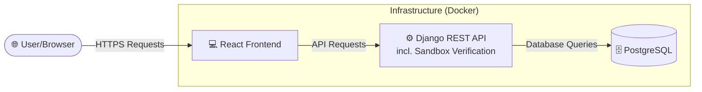

# Open Source Contribution Atelier

      [](https://contribution-atelier-frontend.onrender.com/)

A full-stack learning and operations platform for teaching open source contribution from beginner to advanced levels. The repository is structured for public collaboration and is designed for lesson delivery, challenge tracking, contributor progress, and safe Git practice.

## Stack

- Backend: Django, Django REST framework, Simple JWT, PostgreSQL
- Frontend: React, TypeScript, Vite, Tailwind CSS, React Router
- Infra: Docker, Docker Compose
- Testing: Django test suite, Pytest, Vitest, React Testing Library

## Architecture Overview



## Monorepo Structure

```text
backend/     Django REST API, domain apps, tests, seed script
frontend/    React + TypeScript UI
infra/       Deployment and environment references
scripts/     Repository automation helpers
.github/     Community health files and issue templates
```

## Product Scope

The platform includes:

- Admin-ready lesson and challenge management
- JWT authentication with optional GitHub OAuth extension points
- Progress tracking, badges, scoring, and recommendations
- Interactive web terminal exercises verified by a safe backend sandbox service
- Community metrics and leaderboards
- Repository health files and contributor guidance suitable for public GitHub collaboration

## Quick Start

### Docker

```bash
docker compose up --build
```

Backend is available at `http://localhost:8000/api/` and frontend at `http://localhost:5173`.

### Local Development

1. Copy environment files:

```bash
cp backend/.env.example backend/.env
cp frontend/.env.example frontend/.env
```

2. Configure Google OAuth client (required for Google sign in):

```bash
# frontend/.env
VITE_GOOGLE_CLIENT_ID=your-google-oauth-client-id.apps.googleusercontent.com
```

In Google Cloud Console, add `http://localhost:5173` under **Authorized JavaScript origins**.

3. Backend:

```bash
cd backend
python -m venv .venv
source .venv/bin/activate
pip install -r requirements.txt
python manage.py migrate
python manage.py seed_lessons
python manage.py runserver
```

4. Frontend:

```bash
cd frontend
npm install
npm run dev
```

## Testing

```bash
cd backend && pytest
cd frontend && npm test
```

## CI/CD

This repository ships with a GitHub Actions workflow that runs:

- Backend tests (`pytest`)
- Frontend tests (`npm test`)
- Frontend production build (`npm run build`)

Every push and pull request to `main` is validated automatically.

## Contribution Workflow

Contributors should work on branches, not on `main`.

```bash
git pull origin main
git switch -c feature/short-description
```

After finishing a change:

```bash
git add .
git commit -m "Add concise change summary"
git push -u origin feature/short-description
```

Open a pull request from that branch into `main`.

### Code of Conduct

We are committed to fostering a welcoming and inclusive community. Please read and follow our [Code of Conduct](CODE_OF_CONDUCT.md) to understand the expectations for behavior and reporting guidelines.

## Issue Triage Workflow

To keep the project healthy for new contributors, maintainers should triage issues weekly:

1. Tag new issues with `needs-triage` and classify (`bug`, `enhancement`, `curriculum`).
2. Close duplicates and stale reports; link them to the canonical active issue.
3. Add acceptance criteria before assigning any issue.
4. Mark newcomer-friendly tasks with `good first issue`.

## Repository Safety

- Secrets are excluded from version control
- JWT auth is configured with secure defaults for production
- Sandbox exercise verification is rule-driven and does not execute arbitrary shell commands
- Contribution guides and code ownership expectations are included for public collaboration

## Next Build Steps

This scaffold includes the initial application structure, baseline models, API routes, and UI shell. The next iteration should add full CRUD flows, richer admin moderation tools, stateful sandbox progression, OAuth wiring, and production deployment settings.

## Seeding Sample Lessons

For local development you can populate example lessons and exercises with the management command:

```bash
cd backend
python -m venv .venv
source .venv/bin/activate
pip install -r requirements.txt
python manage.py migrate
python manage.py seed_lessons
```

This creates the basic lesson track used by the frontend; re-running is safe and idempotent.
